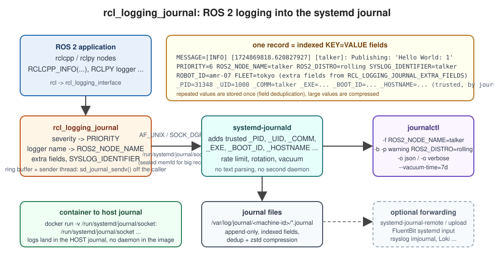

[](https://github.com/fujitatomoya/rcl_logging_journal/actions/workflows/humble.yaml) [](https://github.com/fujitatomoya/rcl_logging_journal/actions/workflows/jazzy.yaml) [](https://github.com/fujitatomoya/rcl_logging_journal/actions/workflows/kilted.yaml) [](https://github.com/fujitatomoya/rcl_logging_journal/actions/workflows/lyrical.yaml) [](https://github.com/fujitatomoya/rcl_logging_journal/actions/workflows/rolling.yaml)
[](https://github.com/fujitatomoya/rcl_logging_journal/actions/workflows/nightly.yaml)

# rcl_logging_journal 📓🔍🐧

[rcl_logging_journal](https://github.com/fujitatomoya/rcl_logging_journal) is an alternative logging backend implementation that can be used for [ROS 2](https://github.com/ros2) applications via [rcl_logging_interface](https://github.com/ros2/rcl_logging/tree/rolling/rcl_logging_interface).

[rcl_logging_journal](https://github.com/fujitatomoya/rcl_logging_journal) uses the [journald native protocol](https://systemd.io/JOURNAL_NATIVE_PROTOCOL/) ([sd_journal_sendv(3)](https://www.freedesktop.org/software/systemd/man/latest/sd_journal_send.html)) to write **structured, indexed log records** straight into [systemd-journald](https://www.freedesktop.org/software/systemd/man/latest/systemd-journald.service.html), the system journal that is already running on every systemd based Linux host.

The main objective is **Enabling ROS 2 logging with the native Linux system journal: per-node filtering with `journalctl`, built-in rotation and retention, structured binary storage, zero additional daemons or configuration**.



See the [overview slide deck](https://raw.githack.com/fujitatomoya/rcl_logging_journal/rolling/doc/overview.html) and the [design document](./doc/design.md) for more information.

## Motivation

ROS 2 ships no tool to *consume* its logs. The default `rcl_logging_spdlog` backend writes one text file per process under `~/.ros/log`, and from there it is `grep`, `less` and a home grown `logrotate` job. Correlating several nodes, filtering by severity over a time window, or looking at what happened right before a robot rebooted is manual work every time.

Linux already has that tool: [journalctl](https://www.freedesktop.org/software/systemd/man/latest/journalctl.html). `rcl_logging_journal` makes ROS 2 log records first class journal entries:

- every record carries indexed fields (`ROS2_NODE_NAME`, `PRIORITY`, `SYSLOG_IDENTIFIER`, `ROS2_DISTRO`, your own fleet fields), so `journalctl ROS2_NODE_NAME=talker` is an index lookup, not a text scan;
- journald adds **trusted** metadata (`_PID`, `_UID`, `_COMM`, `_EXE`, `_BOOT_ID`, `_HOSTNAME`) from kernel credentials, nothing the client can spoof;
- rotation, size and time based retention, vacuuming, compression and field deduplication are built in and configured once in `journald.conf(5)`;
- `journalctl -b -1` shows the previous boot, JSON export is one flag away, and the same files can be shipped to a fleet collector with `systemd-journal-remote`;
- containers log into the **host** journal by binding one socket, no daemon inside the image.

The major difference from [rcl_logging_syslog](https://github.com/fujitatomoya/rcl_logging_syslog) is on the consumption side: log records live in the system storage managed by journald, and developers can use standard utilities such as `journalctl` to see, filter and export them right away. There is no log directory to manage, no rotation to configure, nothing to clean up.

The log pipeline capability of `rcl_logging_syslog` (rsyslog to [FluentBit](https://fluentbit.io/) / [Fluentd](https://www.fluentd.org/) / Loki / remote collectors) is not lost with journald. Both FluentBit ([systemd input](https://docs.fluentbit.io/manual/pipeline/inputs/systemd)) and Fluentd ([fluent-plugin-systemd](https://github.com/fluent-plugin-systemd/fluent-plugin-systemd)) read the journal directly, so the same architecture can be built on top of `rcl_logging_journal`, with the ROS 2 fields already structured instead of parsed from text. Forwarding is not covered in this version yet, that is a temporary limitation and it is planned to be supported just like in `rcl_logging_syslog`. See [design.md](./doc/design.md#11-why-journald-and-not-only-syslog) for a feature by feature comparison.

## Demonstration

```bash
export RCL_LOGGING_IMPLEMENTATION=rcl_logging_journal
ros2 run demo_nodes_cpp talker &
ros2 run demo_nodes_py listener &

journalctl -f ROS2_NODE_NAME=talker
```

```text
Sep 07 10:15:01 robot-07 talker[3141]: [INFO] [1757236501.620827927] [talker]: Publishing: 'Hello World: 1'
Sep 07 10:15:02 robot-07 talker[3141]: [INFO] [1757236502.620758249] [talker]: Publishing: 'Hello World: 2'
Sep 07 10:15:03 robot-07 talker[3141]: [INFO] [1757236503.620777277] [talker]: Publishing: 'Hello World: 3'
```

```bash
journalctl ROS2_NODE_NAME=talker -o verbose -n 1
```

```text
Sun 2026-09-07 10:15:03.620812 JST [s=8a9b5ca9...;i=1a3;b=376ab38e...;m=f37f7688;t=65addc52cde52;x=4332bb0b]
    _TRANSPORT=journal
    _PID=3141
    _UID=1000
    _GID=1000
    _COMM=talker
    _EXE=/opt/ros/rolling/lib/demo_nodes_cpp/talker
    _CMDLINE=/opt/ros/rolling/lib/demo_nodes_cpp/talker
    _BOOT_ID=376ab38eebb14eedb2304ad5aa7f5f0e
    _MACHINE_ID=5e01c53d9dd64ba6b52d4a50543ef4e8
    _HOSTNAME=robot-07
    PRIORITY=6
    ROS2_NODE_NAME=talker
    SYSLOG_IDENTIFIER=talker
    ROS2_DISTRO=rolling
    MESSAGE=[INFO] [1757236503.620777277] [talker]: Publishing: 'Hello World: 3'
```

## Tutorials

- [journalctl basics for ROS 2 logs](./doc/tutorials/Journalctl_Basics.md): per-node filtering, severities, time windows and boots, JSON export, vacuum.
- [ROS 2 in a container, logs in the host journal](./doc/tutorials/Container_Host_Journal.md): bind `/run/systemd/journal/socket`.
- [Rate limits and retention for robots](./doc/tutorials/Rate_Limits_And_Retention.md): `journald.conf` tuning and the shipped drop-in.

## Supported [ROS Distribution](https://docs.ros.org/en/rolling/Releases.html)

| Distribution      | Supported | Branch | Dynamic Loading |
| :---------------- | :-------- | :----- | :-------------- |
| Rolling Ridley    |    ✅    | `rolling` (Development) | ✅ |
| Lyrical Luth      |    ✅    | `lyrical` | ✅ |
| Kilted Kaiju      |    ✅    | `kilted`  | ❌ |
| Jazzy Jalisco     |    ✅    | `jazzy`  | ❌ |
| Humble Hawksbill  |    ✅    | `humble` | ❌ |

Linux with systemd is required at runtime (Ubuntu, Debian, Fedora, ...). The package does not build on Windows or macOS.

## `rcl_logging_implementation`

Starting with [Lyrical Luth](https://docs.ros.org/en/rolling/Releases/Release-Lyrical-Luth.html), ROS 2 introduces [`rcl_logging_implementation`](https://github.com/ros2/rcl_logging/tree/rolling/rcl_logging_implementation), a package that enables runtime dynamic loading of logging backends, similar to how [`rmw_implementation`](https://github.com/ros2/rmw_implementation) works for middleware selection.
This abstraction layer allows users to switch between different logging implementations (such as `rcl_logging_spdlog`, `rcl_logging_noop`, `rcl_logging_syslog` or `rcl_logging_journal`) without rebuilding RCL or application code.

See the [ROS 2 Logging Documentation](https://docs.ros.org/en/rolling/ROS-Framework/nodes/About-Logging/About-Logging.html#rcl-logging-implementation) for more details.

### Runtime Dynamic Loading vs Static Linking

The logging system supports two build configurations:

**Dynamic Loading (Default, Lyrical or later)**

By default, `rcl` links against `rcl_logging_implementation`, which dynamically loads the logging backend at runtime.
This approach provides maximum flexibility, allowing the logging implementation to be changed via the `RCL_LOGGING_IMPLEMENTATION` environment variable without recompilation.

- The logging implementation is loaded as a shared library at runtime.
- No rebuild of `rcl` is required to switch between logging implementations.
- Simply build `rcl_logging_journal` and set the environment variable to use it.

**Static Linking (Kilted or older distributions)**

For Kilted, Jazzy, and Humble distributions, the `rcl_logging_implementation` package is not available.
Users must rebuild `rcl` with the `RCL_LOGGING_IMPLEMENTATION` CMake/environment variable set at build time to statically link `rcl_logging_journal`.

- The specified implementation is statically linked into `rcl` at build time.
- Runtime switching is NOT available.
- Requires rebuilding `rcl` whenever you want to change the logging backend.

## Installation

### Prerequisites

- `libsystemd-dev` (build time) and a running `systemd-journald` (run time).

On a systemd host there is **nothing to set up**: journald is already running, owns `/run/systemd/journal/socket`, and rotates its files. Compare this with the rsyslog daemon, directory and configuration file setup that `rcl_logging_syslog` needs. The only requirement is the libsystemd development package for building:

```bash
### Ubuntu / Debian
sudo apt install libsystemd-dev
### or through rosdep (rosdep key: libsystemd-dev)
rosdep install --from-paths src --ignore-src -y
```

- Reading the journal as a regular user

Writing needs no privileges. Reading the system journal with `journalctl` requires root or membership in the `systemd-journal` group (Ubuntu also grants `adm`):

```bash
sudo usermod -aG systemd-journal $USER   # log out and in again
```

- Containers

A container has no journald. Either bind the host socket into the container so that logs land in the **host** journal (recommended for robots, see the [container tutorial](./doc/tutorials/Container_Host_Journal.md)):

```bash
docker run -it -v /run/systemd/journal/socket:/run/systemd/journal/socket my_ros2_image
```

or start journald as a plain process inside the container (what the CI does, useful for hermetic tests):

```bash
apt install -y systemd
[ -s /etc/machine-id ] || systemd-machine-id-setup
mkdir -p /run/systemd/journal
/usr/lib/systemd/systemd-journald &
```

> [!NOTE]
> We can enable the container with host system privileges but that is NOT recommended, especially for security. Binding the single socket path is enough.

### Install Package

> [!NOTE]
> Update how to install the package here once it is released.

### Build Source

Please follow [ROS 2 Official Development / Installation](https://docs.ros.org/en/rolling/Get-Started/Installation/Alternatives/Ubuntu-Development-Setup.html) to build the `rcl_logging_journal` package below.

There are two ways to build and use `rcl_logging_journal`: **dynamic loading** or **static linking**.
See more details in the [ROS 2 Logging Documentation](https://docs.ros.org/en/rolling/ROS-Framework/nodes/About-Logging/About-Logging.html#rcl-logging-implementation) and the [`rcl_logging_implementation`](#rcl_logging_implementation) section above.

> [!WARNING]
> Kilted or older distributions only support **static linking** and require rebuilding `rcl`.
> See more details for https://github.com/ros2/rcl/issues/1178.

- Dynamic Loading (Lyrical or later, Recommended)

  With `rcl_logging_implementation` available, you only need to build `rcl_logging_journal` and set the `RCL_LOGGING_IMPLEMENTATION` environment variable at runtime. No rebuild of `rcl` is required.

  ```bash
  cd <YOUR_WORKSPACE>/src
  git clone https://github.com/fujitatomoya/rcl_logging_journal.git
  cd <YOUR_WORKSPACE>
  colcon build --symlink-install --packages-select rcl_logging_journal
  ```

  Then, set the environment variable before running your application:

  ```bash
  export RCL_LOGGING_IMPLEMENTATION=rcl_logging_journal
  ros2 run <package> <executable>
  ```

- Static Linking (Kilted or older)

  For distributions that do not have `rcl_logging_implementation`, you must rebuild `rcl` with the `RCL_LOGGING_IMPLEMENTATION` environment variable set at build time.

  ```bash
  cd <YOUR_WORKSPACE>/src
  git clone https://github.com/fujitatomoya/rcl_logging_journal.git
  export RCL_LOGGING_IMPLEMENTATION=rcl_logging_journal
  colcon build --symlink-install --cmake-clean-cache --packages-select rcl_logging_journal rcl
  ```

### Test

The test writes records through `rcl_logging_journal` and reads them back with the `sd_journal` API (and once through `journalctl -o json`), so it needs a running `systemd-journald` and read access to the journal (root, or the `systemd-journal` group). No configuration file is required.

```bash
colcon test --event-handlers console_direct+ --packages-select rcl_logging_journal
colcon test-result --verbose
```

In a container without journald, start one first as shown in [Prerequisites](#prerequisites); [scripts/github_workflows.sh](./scripts/github_workflows.sh) is the exact sequence the CI runs.

### Configuration

If you are using **dynamic loading** (Lyrical or later), set the logging implementation via the `RCL_LOGGING_IMPLEMENTATION` environment variable at runtime.
If you are using **static linking** (Kilted or older), the logging implementation is already linked into `rcl` at build time and this environment variable has no effect.

```bash
export RCL_LOGGING_IMPLEMENTATION=rcl_logging_journal
# then run our application. e.g. "ros2 run <package> <executable>"
```

See more details for [`rcl_logging_implementation`](#rcl_logging_implementation) and the [ROS 2 Logging Documentation](https://docs.ros.org/en/rolling/ROS-Framework/nodes/About-Logging/About-Logging.html#rcl-logging-implementation).

The backend itself is configured through environment variables only. Everything about storage (rotation, retention, compression, rate limits) belongs to `journald.conf(5)`; see the [retention tutorial](./doc/tutorials/Rate_Limits_And_Retention.md) and the optional drop-in [config/ros2-journald.conf](./config/ros2-journald.conf).

| environmental variable | default | Note |
| :----------------------| :------ | :--- |
| `RCL_LOGGING_JOURNAL_IDENTIFIER` | executable name | Value of `SYSLOG_IDENTIFIER`, what `journalctl -t <identifier>` matches. Useful when many nodes share one process, e.g. component containers. |
| `RCL_LOGGING_JOURNAL_EXTRA_FIELDS` | *(empty)* | `;`-separated static `KEY=VALUE` pairs attached to every record, e.g. `ROBOT_ID=amr-07;FLEET=tokyo`. Keys must be `[A-Z0-9_]`, not start with `_`, at most 64 characters, at most 32 entries, and must not be one of the fields set by the backend. Invalid values fail initialization. |
| `RCL_LOGGING_JOURNAL_STRICT` | `1` | `1`: initialization fails with an actionable error when journald is not available. `0`: initialization succeeds and the backend becomes a no-op (rcl's stdout and rosout outputs keep working). |
| `RCL_LOGGING_JOURNAL_SOCKET_PATH` | `/run/systemd/journal/socket` | Path probed at initialization to decide whether journald is available. Diagnostic/testing knob only; libsystemd always sends to the default path. |
| `RCL_LOGGING_JOURNAL_BUFFER_SIZE` | `1M` (1 MiB) | Capacity of the ring buffer that decouples your threads from journald (see [Performance](#performance)). A byte count with an optional `K`, `M` or `G` suffix, from `4K` to `1G`. Bigger absorbs longer bursts without blocking the caller but loses more records if the process is killed before they are sent; only touched pages are resident. Records larger than a quarter of it are sent synchronously. Invalid values fail initialization. |

The backend does **not** filter by severity. rcl already filters on the logger level (`--ros-args --log-level`) before any backend is called, and journald can drop levels at the daemon with `MaxLevelStore=` in `journald.conf(5)`, the same split as `rcl_logging_syslog` with rsyslog. Everything that reaches the backend is stored.

Examples:

```bash
export RCL_LOGGING_JOURNAL_IDENTIFIER=nav2_container
export RCL_LOGGING_JOURNAL_EXTRA_FIELDS="ROBOT_ID=amr-07;FLEET=tokyo"
export RCL_LOGGING_JOURNAL_STRICT=0
export RCL_LOGGING_JOURNAL_BUFFER_SIZE=4M
```

### Record schema

Every ROS 2 log line becomes one journal entry with these fields (all indexed, all usable as `journalctl FIELD=value` matches):

| field | value |
| :---- | :---- |
| `MESSAGE` | the formatted message as produced by rcl (`[INFO] [<stamp>] [<logger>]: <text>`) |
| `PRIORITY` | `7` DEBUG, `6` INFO, `4` WARN, `3` ERROR, `2` FATAL (`journalctl -p warning` etc.; journald fsyncs `2` and below immediately) |
| `ROS2_NODE_NAME` | the rcutils logger name (the node name for node loggers, hierarchical names such as `talker.child` for sub loggers); omitted when rcl logs without a logger name |
| `SYSLOG_IDENTIFIER` | executable name unless overridden (`journalctl -t`) |
| `ROS2_DISTRO` | `$ROS_DISTRO` when set |
| your extra fields | from `RCL_LOGGING_JOURNAL_EXTRA_FIELDS` |
| `_PID`, `_UID`, `_GID`, `_COMM`, `_EXE`, `_CMDLINE`, `_BOOT_ID`, `_MACHINE_ID`, `_HOSTNAME`, `_TRANSPORT=journal`, `_SOURCE_REALTIME_TIMESTAMP` | trusted fields added by journald |

## Usage

Logging messages from ROS 2 applications are stored in the system journal and are available to `journalctl` immediately.

### Examples

```bash
# follow one node live
journalctl -f ROS2_NODE_NAME=talker

# by executable
journalctl -f -t listener

# WARN and above from any ROS 2 node in the last 10 minutes
journalctl -p warning ROS2_DISTRO=rolling --since "10 min ago"

# what did the robot log right before the last reboot?
journalctl -b -1 -p err ROS2_DISTRO=rolling

# everything one process logged, with the trusted metadata
journalctl _PID=3141 -o verbose

# export a node's log as JSON for offline analysis
journalctl ROS2_NODE_NAME=talker -o json > talker.jsonl

# which nodes have logged at all?
journalctl -F ROS2_NODE_NAME

# retention, no logrotate configuration needed
journalctl --disk-usage
sudo journalctl --vacuum-time=7d
```

More in [journalctl basics](./doc/tutorials/Journalctl_Basics.md).

### Rate limiting

journald drops records from a service that logs more than `RateLimitBurst` (default 10000) messages per `RateLimitIntervalSec` (default 30 s) and writes `Suppressed N messages` to the journal. A chatty node at DEBUG level can hit this. Raise the limits per unit (`LogRateLimitBurst=`) or globally in a `journald.conf` drop-in; the shipped [config/ros2-journald.conf](./config/ros2-journald.conf) has commented robot oriented defaults. Details in the [retention tutorial](./doc/tutorials/Rate_Limits_And_Retention.md).

## Performance

`rcl_logging_external_log()` copies the record into a preallocated ring buffer (1 MiB by default, `RCL_LOGGING_JOURNAL_BUFFER_SIZE`) under a mutex and returns; one sender thread per process drains the ring with `sd_journal_sendv()`. The caller therefore pays a `memcpy`, not the `sendmsg()` syscall and journald wake up (about 6 µs on a desktop, see below), which is the same trade `rcl_logging_spdlog` makes with its buffered file sink. Three things keep it safe:

- **FATAL is synchronous**: the call returns only after the record is in journald's hands, and journald fsyncs `CRIT` and above at once, so a FATAL followed by a crash is on disk.
- **Order is preserved**: one consumer sends in enqueue order, also across threads. Records above a quarter of the ring (256 KiB by default) bypass the ring after draining it.
- **Nothing is dropped**: when journald is slower than the producers the ring fills and callers block, exactly like the synchronous version; `rcl_logging_external_shutdown()` (called by `rcl_shutdown`) and process exit drain the ring.

`PRIORITY`, `SYSLOG_IDENTIFIER`, `ROS2_DISTRO` and extra fields are pre-built at initialization; there is no heap allocation, formatting, or filtering on the hot path.

The ceiling is journald itself: it needs roughly 6 to 8 µs of CPU per record on a desktop and rate limits per service, so sustained rates above about 100k records/s per host back up regardless of the client. A ROS 2 node logs in bursts, which the ring absorbs; a node that logs at 100 kHz should not be logging.

[scripts/benchmark](./scripts/benchmark) contains a reproducible harness that drives `rcl_logging_spdlog` (the ROS 2 default, used as the baseline) and `rcl_logging_journal` through the same `rcl_logging_interface` symbols and measures:

- B1 client call latency (p50/p95/p99) per message size and severity,
- B2 system CPU per record including `systemd-journald`,
- B3 sustained throughput and journald suppression,
- B4 bytes on disk for an identical workload,
- B5 query time, `journalctl` field match vs `grep` over the spdlog files.

Before starting, `systemd-journald` must already be running and both backend libraries must be sourced in the workspace (`rcl_logging_spdlog` comes with ROS 2). The harness measures the daemon, it does not start it, and it aborts with a message when a prerequisite is missing.

```bash
systemctl status systemd-journald                 # active on any systemd host
source <YOUR_WORKSPACE>/install/setup.bash
sudo -E scripts/benchmark/run_matrix.sh           # results/<timestamp>/REPORT.md
```

Other backends are not part of this matrix; `rcl_logging_syslog` keeps its own performance evaluation in its repository. The driver itself is generic, so `BACKENDS` can name any `librcl_logging_<name>.so` if you want a local comparison.

Measured numbers depend heavily on the host (disk, journald settings, kernel); run it on your target and read [design.md](./doc/design.md#23-honest-performance-expectations-what-to-verify-not-assume) for what to expect and why.

## Reference

- https://systemd.io/JOURNAL_NATIVE_PROTOCOL/
- https://systemd.io/JOURNAL_FILE_FORMAT/
- https://www.freedesktop.org/software/systemd/man/latest/journalctl.html
- https://www.freedesktop.org/software/systemd/man/latest/journald.conf.html
- https://www.freedesktop.org/software/systemd/man/latest/systemd.journal-fields.html
- https://github.com/fujitatomoya/rcl_logging_syslog
- https://docs.ros.org/en/rolling/ROS-Framework/nodes/About-Logging/About-Logging.html
