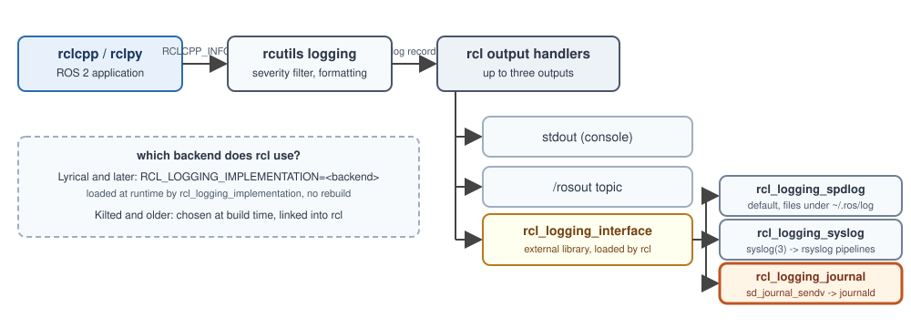

# [rcl_logging_journal](https://github.com/fujitatomoya/rcl_logging_journal)

- ROS 2 rcl logging implementation built on the [journald native protocol](https://systemd.io/JOURNAL_NATIVE_PROTOCOL/).
- Structured, indexed log records in the Linux system journal.
- `journalctl` becomes the ROS 2 log tool. Zero daemons, zero config.

<!---
Companion project of rcl_logging_syslog, same repository structure and CI flow.
--->

---


# Demo

<video controls="controls" width="620" src="https://github.com/user-attachments/assets/df6aa765-af66-480f-aa2f-e06c7c232e02">

<!---
Recorded demo: talker and listener with rcl_logging_journal, filtered live with journalctl. Same video as the README.
--->

---

# Demo: per node filtering

```bash
export RCL_LOGGING_IMPLEMENTATION=rcl_logging_journal
ros2 run demo_nodes_cpp talker &
ros2 run demo_nodes_py listener &

journalctl -f ROS2_NODE_NAME=listener
journalctl -p warning ROS2_DISTRO=rolling
journalctl ROS2_NODE_NAME=talker -o verbose -n 1
```

<!---
Live demo: start talker and listener, switch filters, show -o verbose with trusted fields.
--->

---

# Demo: container to host journal

```bash
docker run -it --rm \
  -v /run/systemd/journal/socket:/run/systemd/journal/socket \
  -e RCL_LOGGING_IMPLEMENTATION=rcl_logging_journal \
  my_ros2_image ros2 run demo_nodes_cpp talker

# on the HOST
journalctl -f ROS2_NODE_NAME=talker
```

- One bind mount, nothing installed or started in the image.
- Host journald owns storage, rotation, retention for every container.
- `_SYSTEMD_CGROUP` / your `CONTAINER=` field tell containers apart.

<!---
The native socket, not /dev/log. Only libsystemd0 is needed in the image, which every Debian/Ubuntu image has.
--->

---

# ROS 2 logging subsystem



<!---
The interface is tiny, which is why alternative backends are cheap to write and safe to swap.
--->

---

# What's the Pain?

- ROS 2 writes log **files** in default with spdlog, but ships no log **reader**.
- `~/.ros/log/<exe>_<pid>_<stamp>.log` per process: `grep`, `less`, hand made `logrotate`.
- No "all WARN+ of node X in the last 10 minutes", no "what happened before the reboot".
- Nothing in the file proves *which* process wrote it.

<!---
rcl_logging_syslog solved the transport problem. The consumption side stayed text.
--->

---

# journald in one slide: the protocol

- `AF_UNIX / SOCK_DGRAM` at `/run/systemd/journal/socket`.
- A record is a set of `KEY=VALUE` fields, **not** a text line.
- Too big for a datagram? libsystemd hands journald a sealed `memfd` (zero copy).
- journald attaches trusted fields from the sender's credentials: `_PID _UID _COMM _EXE _CMDLINE _BOOT_ID _HOSTNAME`.

```
MESSAGE=[INFO] [1757236503.620] [talker]: Publishing: 'Hello World: 3'
PRIORITY=6   ROS2_NODE_NAME=talker
SYSLOG_IDENTIFIER=talker   ROS2_DISTRO=rolling   ROBOT_ID=amr-07
```

<!---
No text parsing on the daemon side, no second daemon, no re-serialization.
--->

---

# journald in one slide: the files

- Append-only, mmap based, read directly by `journalctl` (no daemon round trip).
- **Field deduplication**: `ROS2_NODE_NAME=talker`, `PRIORITY=6` are stored once, referenced by every entry.
- **Compression** (zstd) for payloads above 512 bytes: backtraces yes, short lines no.
- **Indexed**: `journalctl ROS2_NODE_NAME=talker` walks an index, it does not grep.
- **Rotation, vacuum, retention** built in: `SystemMaxUse=`, `MaxRetentionSec=`, `journalctl --vacuum-*`.
- Rotated files stay queryable with the very same command.

<!---
See https://systemd.io/JOURNAL_FILE_FORMAT/ for the details.
--->

---

# journald in one slide: journalctl

```bash
journalctl -f ROS2_NODE_NAME=talker                     # tail one node
journalctl -p warning ROS2_DISTRO=rolling --since "10 min ago"
journalctl -b -1 -p err ROS2_DISTRO=rolling             # previous boot
journalctl _PID=3141 -o verbose                         # trusted metadata
journalctl ROS2_NODE_NAME=talker -o json > talker.jsonl # export
journalctl -F ROS2_NODE_NAME                            # who logged?
sudo journalctl --vacuum-time=7d                        # retention
```

<!---
Every FIELD=value is an exact match on an indexed field. Same field ORs, different fields AND.
--->

---


<!---
One backend, one socket, one daemon that is already running.
--->

---

# rcl_logging_journal: design

| rcl_logging_interface | backend |
|---|---|
| `initialize` | resolve identifier, parse env, probe `/run/systemd/journal/socket`, pre-build constant fields |
| `log(severity, name, msg)` | `memcpy` into a ring buffer (1 MiB default), return; a sender thread does `sd_journal_sendv()` |
| `set_logger_level` | ignored: rcl filters first, journald has `MaxLevelStore=` |
| `shutdown` | drain the ring, report undeliverable count |

- FATAL is synchronous: journald fsyncs `CRIT`, so FATAL + crash is on disk.
- Order preserved (one consumer), nothing dropped (full ring blocks), exit drains.

<!---
Same trade as rcl_logging_spdlog's buffered file sink. The ceiling stays journald's: ~6-8 us of daemon CPU per record, plus its rate limit.
--->

---

# Configuration: env only

| variable | default | purpose |
|---|---|---|
| `RCL_LOGGING_JOURNAL_IDENTIFIER` | executable | `SYSLOG_IDENTIFIER`, `journalctl -t` |
| `RCL_LOGGING_JOURNAL_EXTRA_FIELDS` | empty | `ROBOT_ID=amr-07;FLEET=tokyo`, indexed |
| `RCL_LOGGING_JOURNAL_STRICT` | `1` | fail init without journald, or no-op |
| `RCL_LOGGING_JOURNAL_BUFFER_SIZE` | `1M` | ring buffer capacity, `4K` to `1G` |

- Rotation, compression, rate limits: `journald.conf(5)`, not duplicated here.
- Shipped drop-in: `config/ros2-journald.conf`.

<!---
Same philosophy as RCL_LOGGING_SYSLOG_FACILITY: sane defaults, a few env vars.
--->

---


## Issues and PRs always welcome 🚀

https://github.com/fujitatomoya/rcl_logging_journal

- [design.md](https://github.com/fujitatomoya/rcl_logging_journal/blob/rolling/doc/design.md)
- [tutorials](https://github.com/fujitatomoya/rcl_logging_journal/tree/rolling/doc/tutorials)

<!---
Comment Here
--->
